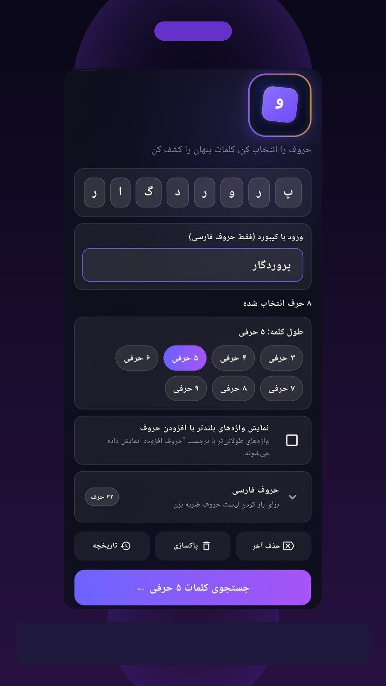
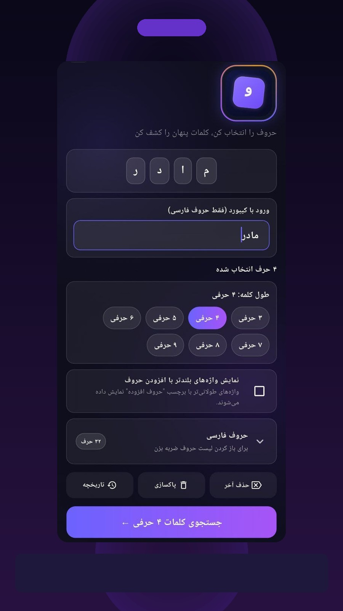
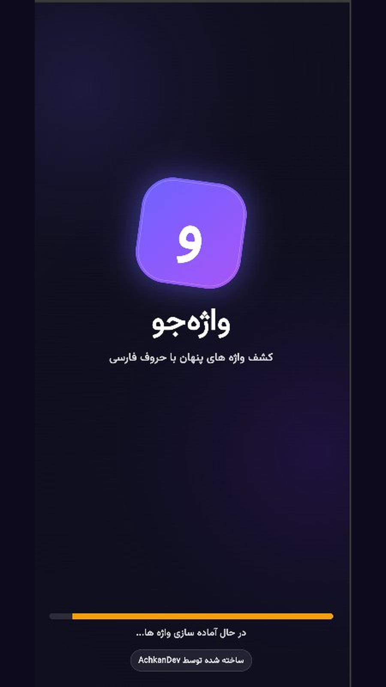
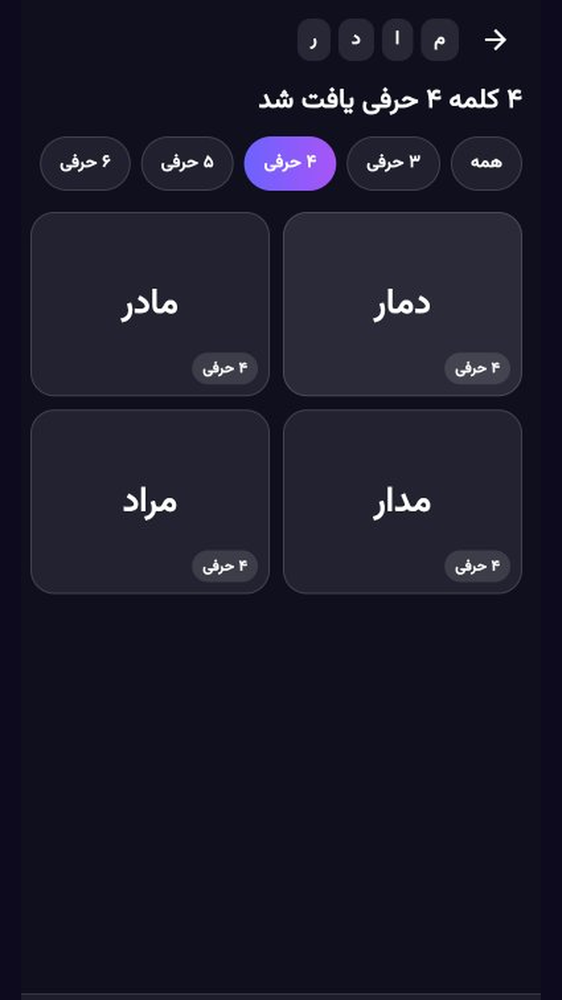
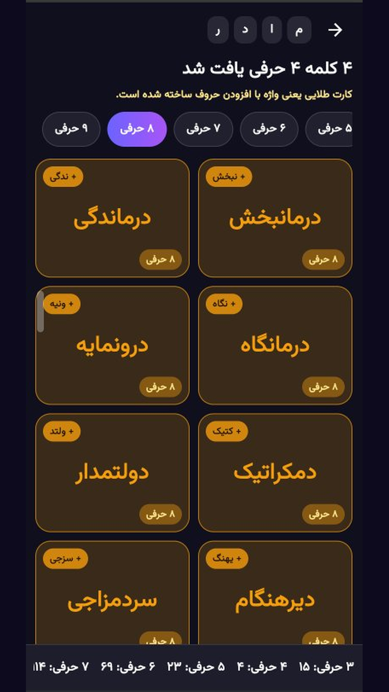
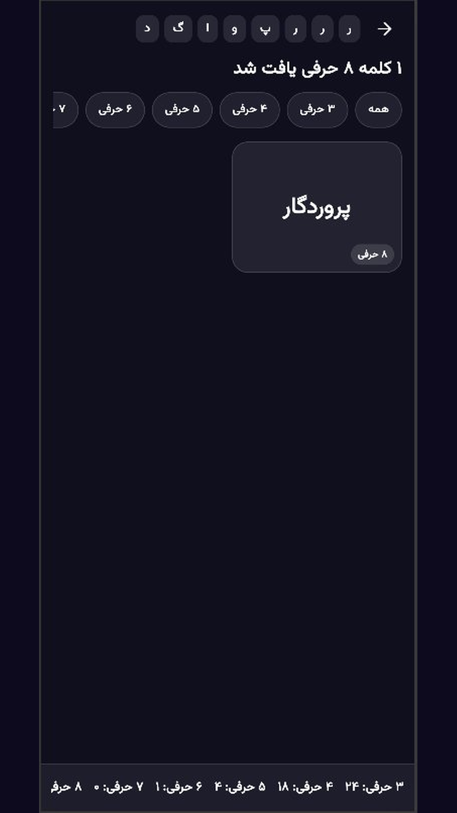

# 🔤 واژه جو (VazheJoo)

**Persian offline word finder** — کشف واژه‌های پنهان با حروف فارسی

---

## ✨ Overview

**VazheJoo** is an offline Persian word finder that helps you discover possible words from selected Persian letters.

- Offline-first (local word list + SQLite)
- Designed for Persian word games
- Fast search with clean UI

---

## 📱 Screenshots

| | | |
|:--:|:--:|:--:|
|  |  |  |
|  |  |  |

---

## 🔗 Store Links

- CafeBazaar: (coming soon)
- Myket: (coming soon)

---

## 🧩 Package

- Android `applicationId`: `com.achkandev.vazhejoo`

---

## 📩 Contact

- GitHub: https://github.com/AchkanDev
- Email: mailto:ashkan.abavi1@gmail.com
